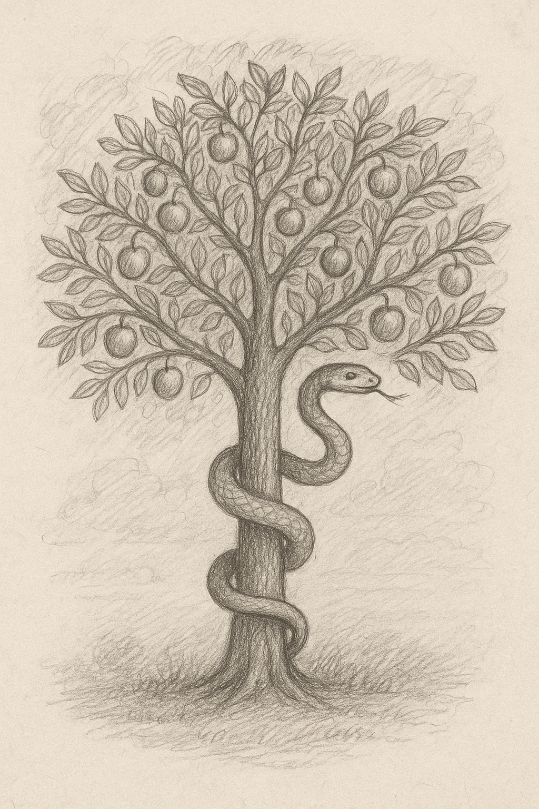

# KnowledgeTree

Are you ready to taste the forbidden fruits of knowledge?

<div style="text-align: center;">

</div>

## Shared LaTeX header:
```
\documentclass{article}

\usepackage[margin=1in]{geometry}
\usepackage{amsmath,amssymb,amsthm}
\usepackage{booktabs}
\usepackage{array}
\usepackage{longtable}
\usepackage{lipsum}
\usepackage{graphicx}
\usepackage{fancyhdr}
\usepackage[colorlinks=true, linkcolor=blue, urlcolor=blue, citecolor=blue]{hyperref}

\pagestyle{fancy}
\fancyhf{}
\fancyhead[L]{}
\fancyhead[R]{\thepage}
\renewcommand{\headrulewidth}{0.4pt}
\renewcommand{\footrulewidth}{0pt}
```
